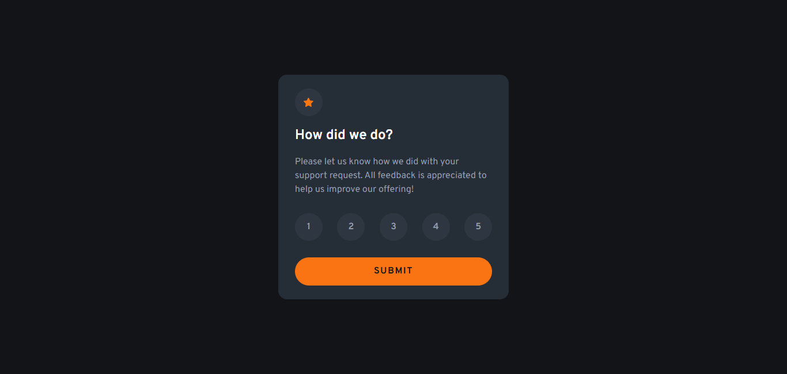

# Frontend Mentor - Interactive rating component solution

This is a solution to the [Interactive rating component challenge on Frontend Mentor](https://www.frontendmentor.io/challenges/interactive-rating-component-koxpeBUmI). Frontend Mentor challenges help you improve your coding skills by building realistic projects.

## Table of contents

- [Overview](#overview)
  - [The challenge](#the-challenge)
  - [Screenshot](#screenshot)
  - [Links](#links)
- [My process](#my-process)
  - [Built with](#built-with)
  - [What I learned](#what-i-learned)
- [Author](#author)

## Overview

### The challenge

Users should be able to:

- View the optimal layout for the app depending on their device's screen size
- See hover states for all interactive elements on the page
- Select and submit a number rating
- See the "Thank you" card state after submitting a rating

### Screenshot

### Links

- Solution URL: [Add solution URL here](https://your-solution-url.com)
- Live Site URL: [Interactive Rating Component](https://gustavo2023.github.io/interactive-rating-component/)

## My process

### Built with

- Semantic HTML5 markup
- CSS custom properties
- Flexbox
- Mobile-first workflow
- JavaScript

### What I learned

During this project, I focused on implementing several key accessibility practices:

- **Semantic HTML:** Used elements like `<main>`, `<form>`, `<fieldset>`, and `<legend>` to provide inherent meaning and structure, improving navigation for assistive technologies.
- **Accessible Form Controls:** Ensured each radio input had a correctly associated `<label>` using the `for` attribute, allowing users to click the label to select the option.
- **Visually Hidden Content:** Implemented a `.visually-hidden` CSS class to hide the `<h1>` visually while keeping it accessible to screen readers, providing a top-level heading for page structure.
- **Focus Visibility:** Added distinct `:focus-visible` styles to all interactive elements (radio buttons via their labels, and the submit button). This provides clear visual feedback for keyboard navigators.
- **Dynamic Content Accessibility:** Used `aria-live="polite"` on the thank-you card container and `role="status"` on the paragraph displaying the result. This ensures that screen readers announce the selected rating when the thank-you card appears without interrupting the user unnecessarily.
- **Image Accessibility:** Provided descriptive `alt` text for all images.

## Author

- Frontend Mentor - [@gustavo2023](https://www.frontendmentor.io/profile/gustavo2023)
